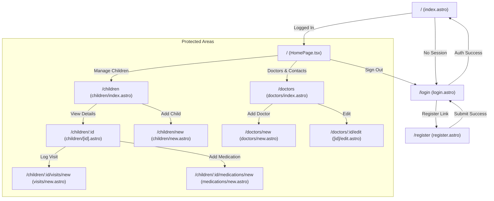

# UI Plan - WeeCare

This document provides a detailed description of the currently implemented User Interface for the WeeCare application. It serves as a source of truth for the app's visual structure, components, and user flows.

## 1. Design System Overview

WeeCare follows a **Minimalist and Functional** design philosophy, prioritizing clarity and ease of use for parents.

| Element | Specification |
| :--- | :--- |
| **Framework** | Astro 5 |
| **UI Library** | React 19 + Shadcn/ui |
| **Styling** | Tailwind CSS 4 |
| **Typography** | Default Sans-serif (Inter/Geist stack) |
| **Aesthetics** | Clean borders, generous whitespace, rounded corners (Shadcn defaults) |

### 1.1 Color Palette (RGB)

| Role | RGB | Description |
| :--- | :--- | :--- |
| **Background** | `#ffffff` | Primary page background |
| **Foreground** | `#09090b` | Primary text color |
| **Primary** | `#18181b` | Action buttons and branding |
| **Secondary** | `#f4f4f5` | Secondary actions and muted backgrounds |
| **Muted** | `#f4f4f5` | Backgrounds for decorative elements |
| **Muted Foreground** | `#71717a` | Secondary/helper text |
| **Destructive** | `#ef4444` | Errors and dangerous actions (Delete) |
| **Border** | `#e4e4e7` | Component and layout borders |

---

## 2. Navigation Flow

The following diagram mirrors the actual code structure, where the Home route acts as the entry point and gatekeeper.

---

## 3. View Hierarchy & Page Documentation

This section describes the tree structure of the views for each page.

### 3.1 Home Dashboard (`/`)

| Element | Description |
| :--- | :--- |
| **Title** | Large font "WeeCare" heading. |
| **Subtitle** | "Child Medical History Tracker" tagline. |
| **User Display** | Text showing the currently logged-in user's email. |
| **Manage Children** | Primary button leading to the /children listing. |
| **Doctors & Contacts** | Secondary button leading to the /doctors directory. |
| **Sign Out** | Outline button for ending the session and redirecting to login. |

### 3.2 Authentication

#### Login Page (`/login`)

| Element | Description |
| :--- | :--- |
| **Email Input** | Standard text field for account email. |
| **Password Input** | Hidden text field for account password. |
| **Sign In Button** | Primary button to initiate authentication. |
| **Register Link** | Text link for navigating to the registration page. |

#### Register Page (`/register`)

| Element | Description |
| :--- | :--- |
| **Email Input** | Standard text field for account email. |
| **Password Input** | Hidden text field (min 6 chars). |
| **Confirm Password** | Confirmation field with match validation. |
| **Sign Up Button** | Primary button to create a new account. |
| **Login Link** | Text link for navigating to the login page. |

### 3.3 Children Management

#### Children List (`/children`)

| Element | Description |
| :--- | :--- |
| **Add Child Button** | Primary button to navigate to the creation form. |
| **Empty State Card** | Shows "No children added yet" with a call to action when list is empty. |
| **Child Card** | Grid item showing Name, Age, and Birthday. |
| **Allergy Badges** | Small list of destructive-styled badges for each allergy. |
| **View Details** | Button navigating to the child's dashboard. |
| **Delete Button** | Destructive button triggering a confirmation dialog. |
| **Back to Home** | Outline button for global navigation back to dashboard. |

#### Child Dashboard (`/children/:id`)

| Element | Description |
| :--- | :--- |
| **Child Profile Header** | Displays Name, Age, DOB, and Allergy badges at the top. |
| **Tabs Navigation** | Switches between Overview, Visits, and Medications. |
| **Recent Visits Card** | Summary of the last 3 visits with a "Log Visit" button. |
| **Active Medications** | List of currently taken meds with an "Add Medication" button. |
| **Visit History** | Detailed timeline of all visits with dates and notes. |
| **Medication History** | Full history of meds with Active/Ended status badges. |
| **Back to List** | Outline button to return to the children directory. |

#### Visit Logging (`/children/:id/visits/new`)
Form for recording doctor appointment details.

| Element | Description |
| :--- | :--- |
| **Date Input** | HTML5 Date picker, defaults to today. |
| **Reason Input** | Text input for the primary reason for the visit. |
| **Diagnosis** | Text input for the doctor's findings. |
| **Notes** | Textarea for detailed instructions or comments. |
| **Save / Cancel** | Action buttons for form submission or exit. |

#### Medication Management (`/children/:id/medications/new`)
Form for tracking prescriptions.

| Element | Description |
| :--- | :--- |
| **Name Input** | Text input for medication name. |
| **Dosage** | Text input (e.g., "5ml"). |
| **Frequency** | Text input (e.g., "3x daily"). |
| **Start/End Dates** | HTML5 Date pickers. |
| **Active Toggle** | Checkbox to indicate if currently being taken. |
| **Save / Cancel** | Action buttons for medication tracking. |

### 3.4 Doctors & Contacts

#### Doctors List (`/doctors`)

| Element | Description |
| :--- | :--- |
| **Add Doctor Button** | Primary button to open the contact creation form. |
| **Doctor Card** | Displays Name, Specialty, and contact icons (Phone, Email, Address). |
| **Action Icons** | Clickable icons for Phone and Email (using `mailto:` and `tel:`). |
| **Notes Section** | Block of text showing personal opinions or clinic details. |
| **Edit Button** | Icon button to modify existing doctor info. |
| **Delete Button** | Destructive icon button with confirmation dialog. |
| **Back to Home** | Outline button returning to the main dashboard. |

#### Doctor Form (`/doctors/new` and `/doctors/:id/edit`)
Unified form for adding or updating medical professional contacts.

| Element | Description |
| :--- | :--- |
| **Name Input** | Required field for the doctor's full name. |
| **Specialty Input** | Text field for medical area (e.g., "Pediatrician"). |
| **Phone/Email** | Contact fields for direct communication. |
| **Address** | Textarea for the clinic or office location. |
| **Notes** | Textarea for personal opinions, reviews, or office hours. |
| **Submit Button** | Dynamic label: "Add Doctor" or "Update Doctor". |
| **Cancel Button** | Outline button to return to the directory listing. |

---

## 4. Reusable UI Components

The application uses **Shadcn/ui** components extensively for consistency:

| Component | Usage |
| :--- | :--- |
| **Card** | Used for all list items and form containers. |
| **Button** | `default` for primary actions, `outline` for secondary, `destructive` for delete. |
| **Badge** | Used for Allergies (Destructive/Secondary) and Medication status (Default/Secondary). |
| **Tabs** | Used in Child Dashboard to separate history types. |
| **AlertDialog** | Mandatory confirmation before deleting Child or Doctor profiles. |
| **Input/Textarea** | Standardized form fields with consistent focus states. |

---

## 5. UI Logic & States

- **Loading State**: A centered "Loading..." message is shown during data fetching.
- **Empty States**: Cards with descriptive text and an "Add" button appear when lists are empty.
- **Responsive Design**: Lists switch from single column (mobile) to multi-column (desktop) using Tailwind's grid utilities.
- **Authentication Guard**: Client-side redirects in components ensure unauthenticated users are kicked back to `/login`.
